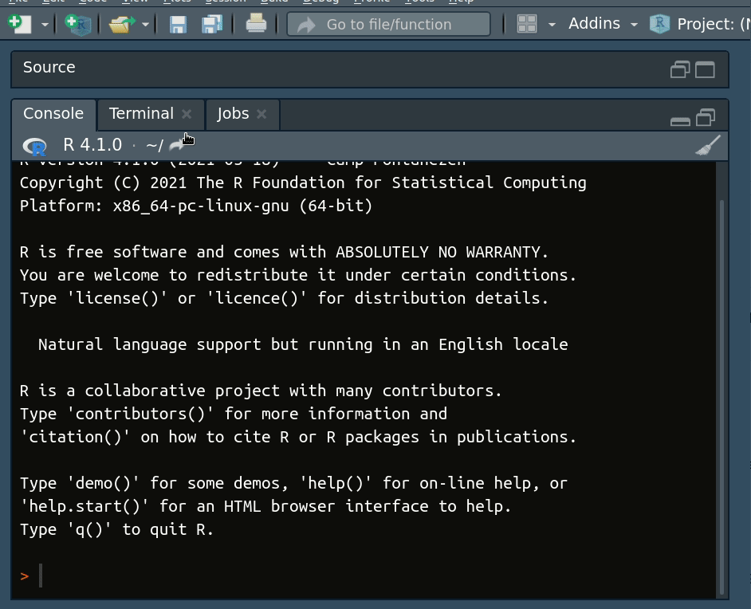

# MCWorkshop
## Workshop "Advancing Quantitative Science with Monte Carlo Simulation"

PsyPag & MSCP-Section Simulation Summer School

June 16, 2021

To download the materials, open RStudio, then go to File --> New Project --> Version Control --> Git, and then for the field "Repository URL," type in "https://github.com/marklhc/MCWorkshop", and for the field "Create project as subdirectory of:" choose where you want to download the materials. 

Example 1: [simulate_mean_median.md](simulate_mean_median.md)

Example 2: [example_sem.md](example_sem.md)

Recorded videos: https://youtube.com/playlist?list=PL8yE0xYJxnw2CPgORbAAmnvGZLHtVu1Pb

 This work is licensed under a <a rel="license" href="http://creativecommons.org/licenses/by-nc-sa/4.0/">Creative Commons Attribution-NonCommercial-ShareAlike 4.0 International License</a>.

