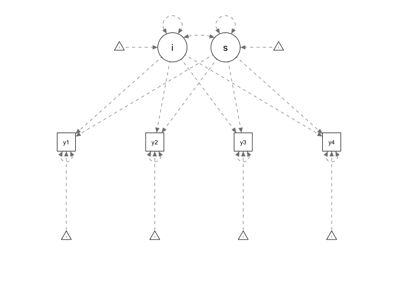

Simulation Example on Structural Equation Modeling
================
Mark Lai
April 29, 2019, last updated on June 06, 2021

-   [Simulation Example on Structural Equation Modeling (SEM) Using the
    `SimDesign`
    Package](#simulation-example-on-structural-equation-modeling-sem-using-the-simdesign-package)
    -   [Simulate Multivariate Data](#simulate-multivariate-data)
    -   [Workflow for Using `SimDesign`](#workflow-for-using-simdesign)
        -   [Step 1: Create data frame of design
            factors](#step-1-create-data-frame-of-design-factors)
        -   [Step 2: Define a function for generating
            data](#step-2-define-a-function-for-generating-data)
        -   [Step 3: Define a function for analyzing the simulated
            data](#step-3-define-a-function-for-analyzing-the-simulated-data)
        -   [Step 4: Define a function for evaluating the sample
            results](#step-4-define-a-function-for-evaluating-the-sample-results)
        -   [Step 5: Test Run the
            simulation](#step-5-test-run-the-simulation)
        -   [Step 6: Full simulation](#step-6-full-simulation)
    -   [Summarize Simulation Results](#summarize-simulation-results)
        -   [ANOVA](#anova)
    -   [Exercise](#exercise)

# Simulation Example on Structural Equation Modeling (SEM) Using the `SimDesign` Package

Recently, the `SimDesign` package was developed so that designing and
running simulation studies can be more structured and organized. The
package also provides some great features such as parallel computing,
fail-safe stopping, gathering of error or warning messages, among
others. Check out the paper by Sigal & Chalmers (2016) as well as the
package vignettes
(<https://cran.r-project.org/web/packages/SimDesign/index.html>) for
more information. Below is a quick hands-on example for using the
package.

``` r
# Load required packages
library(tidyverse)
theme_set(theme_classic() +
            theme(panel.grid.major.y = element_line(color = "grey92")))
library(SimDesign)
library(mnormt)
library(lavaan)
```

## Simulate Multivariate Data

In SEM, when multivariate normality is assumed, one can either generate
data directly using matrix algebra, or generate the latent variables
first before generating the observed variables. The first method is
faster, but the second method is more general and can be applied to
situations like categorical data or multilevel data. Therefore, in this
note we’ll use the second method.

Let’s do a latent growth model (LGM) similar to the one in the note
“Simulating Multilevel Data.” Here is the model in a latent growth model
representation:


where

are the outcome values for person
 from time 0 to time 3,

is the specific intercept for person
,

is the specific slope for person
, and

are the within-person level error term. The distributional assumptions
are

![
  \\begin{aligned}
  \\begin{bmatrix}
    \\eta\_{1i} \\\\
    \\eta\_{2i}
  \\end{bmatrix} & \\sim 
  \\mathcal{N}\\left(\\begin{bmatrix}
                \\alpha\_1 \\\\
                \\alpha\_2
              \\end{bmatrix}, 
              \\begin{bmatrix}
                \\phi\_{11} & \\phi\_{21} \\\\
                \\phi\_{21} & \\phi\_{22}
              \\end{bmatrix}\\right) \\\\
  \\begin{bmatrix}
    e\_{0i} \\\\
    e\_{1i} \\\\
    e\_{2i} \\\\
    e\_{3i}
  \\end{bmatrix} & \\sim
  \\mathcal{N}\\left(\\begin{bmatrix}
                0 \\\\
                0 \\\\
                0 \\\\
                0
              \\end{bmatrix}, 
              \\begin{bmatrix}
                \\theta\_{11} & 0 & 0 & 0 \\\\
                0 & \\theta\_{22} & 0 & 0 \\\\
                0 & 0 & \\theta\_{33} & 0 \\\\
                0 & 0 & 0 & \\theta\_{44} \\\\
              \\end{bmatrix}\\right)
  \\end{aligned}
](https://latex.codecogs.com/png.latex?%0A%20%20%5Cbegin%7Baligned%7D%0A%20%20%5Cbegin%7Bbmatrix%7D%0A%20%20%20%20%5Ceta_%7B1i%7D%20%5C%5C%0A%20%20%20%20%5Ceta_%7B2i%7D%0A%20%20%5Cend%7Bbmatrix%7D%20%26%20%5Csim%20%0A%20%20%5Cmathcal%7BN%7D%5Cleft%28%5Cbegin%7Bbmatrix%7D%0A%20%20%20%20%20%20%20%20%20%20%20%20%20%20%20%20%5Calpha_1%20%5C%5C%0A%20%20%20%20%20%20%20%20%20%20%20%20%20%20%20%20%5Calpha_2%0A%20%20%20%20%20%20%20%20%20%20%20%20%20%20%5Cend%7Bbmatrix%7D%2C%20%0A%20%20%20%20%20%20%20%20%20%20%20%20%20%20%5Cbegin%7Bbmatrix%7D%0A%20%20%20%20%20%20%20%20%20%20%20%20%20%20%20%20%5Cphi_%7B11%7D%20%26%20%5Cphi_%7B21%7D%20%5C%5C%0A%20%20%20%20%20%20%20%20%20%20%20%20%20%20%20%20%5Cphi_%7B21%7D%20%26%20%5Cphi_%7B22%7D%0A%20%20%20%20%20%20%20%20%20%20%20%20%20%20%5Cend%7Bbmatrix%7D%5Cright%29%20%5C%5C%0A%20%20%5Cbegin%7Bbmatrix%7D%0A%20%20%20%20e_%7B0i%7D%20%5C%5C%0A%20%20%20%20e_%7B1i%7D%20%5C%5C%0A%20%20%20%20e_%7B2i%7D%20%5C%5C%0A%20%20%20%20e_%7B3i%7D%0A%20%20%5Cend%7Bbmatrix%7D%20%26%20%5Csim%0A%20%20%5Cmathcal%7BN%7D%5Cleft%28%5Cbegin%7Bbmatrix%7D%0A%20%20%20%20%20%20%20%20%20%20%20%20%20%20%20%200%20%5C%5C%0A%20%20%20%20%20%20%20%20%20%20%20%20%20%20%20%200%20%5C%5C%0A%20%20%20%20%20%20%20%20%20%20%20%20%20%20%20%200%20%5C%5C%0A%20%20%20%20%20%20%20%20%20%20%20%20%20%20%20%200%0A%20%20%20%20%20%20%20%20%20%20%20%20%20%20%5Cend%7Bbmatrix%7D%2C%20%0A%20%20%20%20%20%20%20%20%20%20%20%20%20%20%5Cbegin%7Bbmatrix%7D%0A%20%20%20%20%20%20%20%20%20%20%20%20%20%20%20%20%5Ctheta_%7B11%7D%20%26%200%20%26%200%20%26%200%20%5C%5C%0A%20%20%20%20%20%20%20%20%20%20%20%20%20%20%20%200%20%26%20%5Ctheta_%7B22%7D%20%26%200%20%26%200%20%5C%5C%0A%20%20%20%20%20%20%20%20%20%20%20%20%20%20%20%200%20%26%200%20%26%20%5Ctheta_%7B33%7D%20%26%200%20%5C%5C%0A%20%20%20%20%20%20%20%20%20%20%20%20%20%20%20%200%20%26%200%20%26%200%20%26%20%5Ctheta_%7B44%7D%20%5C%5C%0A%20%20%20%20%20%20%20%20%20%20%20%20%20%20%5Cend%7Bbmatrix%7D%5Cright%29%0A%20%20%5Cend%7Baligned%7D%0A "
  \begin{aligned}
  \begin{bmatrix}
    \eta_{1i} \\
    \eta_{2i}
  \end{bmatrix} & \sim 
  \mathcal{N}\left(\begin{bmatrix}
                \alpha_1 \\
                \alpha_2
              \end{bmatrix}, 
              \begin{bmatrix}
                \phi_{11} & \phi_{21} \\
                \phi_{21} & \phi_{22}
              \end{bmatrix}\right) \\
  \begin{bmatrix}
    e_{0i} \\
    e_{1i} \\
    e_{2i} \\
    e_{3i}
  \end{bmatrix} & \sim
  \mathcal{N}\left(\begin{bmatrix}
                0 \\
                0 \\
                0 \\
                0
              \end{bmatrix}, 
              \begin{bmatrix}
                \theta_{11} & 0 & 0 & 0 \\
                0 & \theta_{22} & 0 & 0 \\
                0 & 0 & \theta_{33} & 0 \\
                0 & 0 & 0 & \theta_{44} \\
              \end{bmatrix}\right)
  \end{aligned}
")

A path diagram is shown below:

``` r
growth_model <- "i =~ 1*y1 + 1*y2 + 1*y3 + 1*y4
                 s =~ 0*y1 + 1*y2 + 2*y3 + 3*y4
                 i ~~ 1 * i
                 s ~~ 0.2 * s + 0.1 * i
                 y1 ~~ 0.5 * y1
                 y2 ~~ 0.5 * y2
                 y3 ~~ 0.5 * y3
                 y4 ~~ 0.5 * y4
                 i ~ 1 * 1
                 s ~ 0.5 * 1"
library(semPlot)
semPaths(semPlotModel_lavaanModel(growth_model))
```

<!-- -->

## Workflow for Using `SimDesign`

### Step 1: Create data frame of design factors

In a methodological experiment with Monte Carlo simulation, one usually
generates millions of data sets across tens or hundreds of carefully
chosen conditions. As an example, here is a small scale simulation study
on LGM. The two goals are: (a) to understand the bias on the mean of
slopes and its standard error estimates, and (b) to illustrate the
difference between estimated and empirical standard error.

For simplicity, I’ll only choose three **designed factors** (i.e.,
manipulated independent variables), namely sample size, variance of the
random slope in the data generating model, and the mean of the slopes.
The design factors are summarized here:

-   Sample size (*N*): 50, 100, 200
-   Variance of slopes
    ():
    0.1, 0.5 (i.e., 1/10 and 1/2 of the intercept variance)
-   Mean of slopes
    ():
    1, 0.5

Therefore, it’s a 3
 2
 2
factorial design.

``` r
# Design factors:
designfactor <- createDesign(
  N = c(50, 100, 200), 
  phi22 = c(0.1, 0.5), 
  alpha2 = c(0, 0.5)
)
designfactor
```

    ># # A tibble: 12 x 3
    >#        N phi22 alpha2
    >#    <dbl> <dbl>  <dbl>
    >#  1    50   0.1    0  
    >#  2   100   0.1    0  
    >#  3   200   0.1    0  
    >#  4    50   0.5    0  
    >#  5   100   0.5    0  
    >#  6   200   0.5    0  
    >#  7    50   0.1    0.5
    >#  8   100   0.1    0.5
    >#  9   200   0.1    0.5
    ># 10    50   0.5    0.5
    ># 11   100   0.5    0.5
    ># 12   200   0.5    0.5

#### Fixed Values for the Study

In a simulation study, we cannot manipulate every possible variables. So
while we have designed on three design factors before, each with
multiple levels, there are values that we want to set to some constant
values, such as the mean and the variance of intercepts, etc. In
`SimDesign` these will be passed to different functions using a named
list called `fixed_objects`. Let’s create such a list:

``` r
fixed_obj <- list(phi11 = 1, 
                  Lambda = cbind(1, seq_len(4)), 
                  Theta = diag(0.5, nrow = 4))
```

### Step 2: Define a function for generating data

Create function for generating the data:

``` r
gen_lgm_data <- function(condition, fixed_objects = NULL) {
  N <- condition$N
  phi22 <- condition$phi22
  alpha2 <- condition$alpha2
  alpha <- c(1, alpha2)
  Phi <- matrix(c(fixed_objects$phi11, phi22 / 2,
                  phi22 / 2, phi22), nrow = 2)
  Lambda <- fixed_objects$Lambda
  Theta <- fixed_objects$Theta
  # Generate latent factor scores
  eta <- rmnorm(N, mean = alpha, varcov = Phi)
  # Generate residuals:
  e <- rmnorm(N, varcov = Theta)
  # Compute outcome scores
  y <- tcrossprod(eta, Lambda) + e
  colnames(y) <- paste0("y", 1:4)
  # Make it a data frame
  as.data.frame(y)
}
```

We can test that the function works for, say, condition 1 (i.e., row 1
of `designfactor`):

``` r
(test_data <- gen_lgm_data(designfactor[1, ], fixed_objects = fixed_obj))
```

    >#             y1          y2          y3          y4
    ># 1   1.02085395  0.25317179  0.25518770 -0.99233088
    ># 2   1.89284766  2.83137192  0.32105189  1.46260379
    ># 3   2.89895991  1.61000766  1.19098210  2.54345535
    ># 4   1.08955919  0.53686302 -1.89316428  0.60192746
    ># 5   3.41056732  2.61105205  2.15551731  1.27354473
    ># 6   0.69710759  1.11064750  1.62660893  0.30071652
    ># 7  -0.65504036 -0.08129605 -0.26982211 -1.64668932
    ># 8   1.47415998  2.71133884  1.10017583  1.85395755
    ># 9  -1.03771294 -0.39039463 -1.74806153 -0.41162786
    ># 10  3.21688828  2.24349132  1.24436817  1.53491421
    ># 11  1.02830590  1.33112043  0.82060089 -0.61099016
    ># 12  1.73217879  2.21086975  2.93886228  3.37123807
    ># 13 -2.47293546 -1.29352565 -2.52995369 -3.34050038
    ># 14 -0.07006658 -1.26080492 -0.17386701 -0.92203915
    ># 15  1.33944106 -0.05360172 -0.10040466 -0.15063024
    ># 16 -1.74589879 -3.58490435 -4.63046357 -4.53023923
    ># 17  0.13364108  0.95826870  1.02019318  0.83479066
    ># 18  0.21226626  0.31850647  0.06917167  0.74982893
    ># 19 -0.82601414  0.27695475 -1.03002559 -0.05278769
    ># 20  1.79759100  0.78157521  1.13403799  0.82694516
    ># 21  2.10270915  2.47258432  3.31672092  3.89466608
    ># 22  1.36360492  1.83753338  0.91649093  0.95787228
    ># 23  2.15072846  3.01981814  2.53865330  3.49527049
    ># 24  2.69864947  1.26393168  4.17027740  3.20636630
    ># 25 -1.21852974 -0.98763119  0.19478272 -0.86239297
    ># 26  2.70055897  2.56285041  2.84330936  2.03657102
    ># 27 -1.84777617 -0.90182601 -0.67979262 -1.47973856
    ># 28  1.72232512  1.10834011  2.04891150  2.99016645
    ># 29  3.30396519  2.71838502  3.03921184  3.48041708
    ># 30  2.33564745  0.75129266  1.94399775  2.16866640
    ># 31  0.78112950  0.77972942  0.48803668  0.73371477
    ># 32  0.90337759  0.44651317 -0.76232667 -1.07914960
    ># 33  1.99144790  3.05123271  3.16322433  2.87153777
    ># 34  2.64348435  3.51502417  2.73394955  2.72069489
    ># 35  2.57433668  4.21936249  3.96752711  5.25205918
    ># 36  1.15846048  1.09284885  0.35669414 -0.63683317
    ># 37  0.21195613 -0.56247067 -0.60557685 -0.41794001
    ># 38 -0.47835516  2.55773194  2.15431424  1.37550625
    ># 39  1.49760336 -0.27241669  1.34411186  0.46761026
    ># 40  0.68625578  1.10909360  0.58891619 -1.21119175
    ># 41  0.86049016  1.12454031  1.00333882  0.19192206
    ># 42  1.57842823  0.61469372  0.09240562  0.88343175
    ># 43 -1.54469230 -3.36765893 -2.17811619 -2.62249544
    ># 44  1.18420598  0.81462572  0.79419451  0.80703213
    ># 45 -0.18503989  0.18668266  0.93661057 -0.89114339
    ># 46  2.06227620  4.40560381  4.31356764  2.92411409
    ># 47  1.50746330  0.99880863 -0.32114824  0.31192297
    ># 48 -0.67301347 -1.01544458 -1.31757121 -1.55261032
    ># 49  2.16349773  3.21722851  0.81175889  2.68205766
    ># 50 -0.97124945 -1.93916405 -2.44339945 -2.86094596

If you want to check whether the simulated data is correct, generate
with a large sample size, and check the means and covariances:

``` r
large_test_df <- gen_lgm_data(tibble(N = 1e5, phi22 = 0.1, alpha2 = 0.5), 
                              fixed_objects = fixed_obj)
colMeans(large_test_df)
```

    >#       y1       y2       y3       y4 
    ># 1.499431 2.000718 2.499398 3.001322

``` r
cov(large_test_df)
```

    >#          y1       y2       y3       y4
    ># y1 1.689034 1.343337 1.493369 1.642095
    ># y2 1.343337 2.104909 1.854246 2.105730
    ># y3 1.493369 1.854246 2.700796 2.553730
    ># y4 1.642095 2.105730 2.553730 3.505012

#### Note: Other methods for generating SEM data

Many SEM software or packages have capability in generating data with
input of an SEM model. For example, in R, you can call Mplus using the
`MplusAutomation` package and use their `MONTECARLO` routine. In R, you
can generate SEM data using the `lavaan` package with the
`simulateData()` function, like the following example:

``` r
# Using a previously defined SEM model:
lavaan::simulateData(growth_model) %>% 
  head() # shows only the first six cases
```

    >#           y1        y2         y3        y4
    ># 1  3.1312882 4.1441789  4.9975051  5.809730
    ># 2  1.3649874 1.3663932  3.7170062  4.359383
    ># 3  3.3882473 3.3575449  2.0219841  3.405381
    ># 4  2.0402375 1.7758214  0.7636667  1.643502
    ># 5  0.2931383 1.3966473  0.4917014  1.403948
    ># 6 -0.1855835 0.4633854 -1.2052212 -1.178754

Personally, however, I prefer directly simulating data in R because

-   it forces you to specify everything in the model in the way you
    want. Especially in Mplus there are a lot of hidden default settings
    that may mess up with your simulation;
-   it makes the process of generating data more transparent;
-   it helps you learn the math behind the model;
-   it is more flexible as you can specify any distributional
    assumptions or models not supported by the SEM packages.

### Step 3: Define a function for analyzing the simulated data

In R, for running SEM models, the most common options are `lavaan`,
`OpenMx`, and Mplus (via `MplusAutomation`). When possible, I’ll stick
to `lavaan` to avoid jumping between programs, so let’s analyze the
simulated data twice, first with the true model and second with a
misspecified model where the random slope term is omitted (i.e., the
variance of `s` is constrained to zero).

``` r
analyze_lgm <- function(condition, dat, fixed_objects = NULL) {
  m1 <- 'i =~ 1 * y1 + 1 * y2 + 1 * y3 + 1 * y4
         s =~ 0 * y1 + 1 * y2 + 2 * y3 + 3 * y4
         i ~~ s'
  m2 <- 'i =~ 1 * y1 + 1 * y2 + 1 * y3 + 1 * y4
         s =~ 0 * y1 + 1 * y2 + 2 * y3 + 3 * y4
         s ~~ 0 * i + 0 * s'
  # Run model 1
  m1_fit <- growth(m1, data = dat)
  # Run model 2
  m2_fit <- growth(m2, data = dat)
  # Extract parameter estimates and standard errors
  ret <- c(coef(m1_fit)["s~1"], 
           sqrt(vcov(m1_fit)["s~1", "s~1"]),
           coef(m2_fit)["s~1"], 
           sqrt(vcov(m2_fit)["s~1", "s~1"]))
  names(ret) <- c("m1_est", "m1_se", "m2_est", "m2_se")
  ret
}
```

Test the function:

``` r
analyze_lgm(designfactor[1, ], dat = test_data)
```

    >#      m1_est       m1_se      m2_est       m2_se 
    ># -0.11767537  0.05303894 -0.12137165  0.04994210

### Step 4: Define a function for evaluating the sample results

``` r
# Helper function for computing relative SE bias
rse_bias <- function(est_se, est) {
  est_se <- as.matrix(est_se)
  est <- as.matrix(est)
  est_se <- colMeans(est_se)
  emp_sd <- apply(est, 2L, sd)
  est_se / emp_sd - 1
}
evaluate_lgm <- function(condition, results, fixed_objects = NULL) {
  alpha2 <- condition$alpha2
  c(bias = bias(results[ , c("m1_est", "m2_est")], parameter = alpha2), 
    std_bias = bias(results[ , c("m1_est", "m2_est")], parameter = alpha2, 
                    type = "standardized"), 
    rmse = RMSE(results[ , c("m1_est", "m2_est")], parameter = alpha2), 
    rse_bias = rse_bias(results[ , c("m1_se", "m2_se")], 
                        results[ , c("m1_est", "m2_est")])
  )
}
```

### Step 5: Test Run the simulation

Trial run with 2 replications

``` r
sim_trial <- runSimulation(designfactor, 
                           replications = 2, 
                           generate = gen_lgm_data, 
                           analyse = analyze_lgm, 
                           summarise = evaluate_lgm, 
                           fixed_objects = fixed_obj)
```

    ># 
    ># Design row: 1/12;   Started: Sun Jun  6 16:10:15 2021;   Total elapsed time: 0.00s 
    ># 
    ># Design row: 2/12;   Started: Sun Jun  6 16:10:15 2021;   Total elapsed time: 0.22s 
    ># 
    ># Design row: 3/12;   Started: Sun Jun  6 16:10:15 2021;   Total elapsed time: 0.39s 
    ># 
    ># Design row: 4/12;   Started: Sun Jun  6 16:10:16 2021;   Total elapsed time: 0.59s 
    ># 
    ># Design row: 5/12;   Started: Sun Jun  6 16:10:16 2021;   Total elapsed time: 0.78s 
    ># 
    ># Design row: 6/12;   Started: Sun Jun  6 16:10:16 2021;   Total elapsed time: 0.97s 
    ># 
    ># Design row: 7/12;   Started: Sun Jun  6 16:10:16 2021;   Total elapsed time: 1.17s 
    ># 
    ># Design row: 8/12;   Started: Sun Jun  6 16:10:16 2021;   Total elapsed time: 1.34s 
    ># 
    ># Design row: 9/12;   Started: Sun Jun  6 16:10:17 2021;   Total elapsed time: 1.56s 
    ># 
    ># Design row: 10/12;   Started: Sun Jun  6 16:10:17 2021;   Total elapsed time: 1.74s 
    ># 
    ># Design row: 11/12;   Started: Sun Jun  6 16:10:17 2021;   Total elapsed time: 1.93s 
    ># 
    ># Design row: 12/12;   Started: Sun Jun  6 16:10:17 2021;   Total elapsed time: 2.12s

    ># 
    ># Simulation complete. Total execution time: 2.30s

Hopefully it runs fine. If there’s any error, we have to go back and
check each component. The errors from `SimDesign` provides some hints.

### Step 6: Full simulation

Now we’re ready to run 500 replications. The `runSimulation()` function
has a number of handy arguments. Here I will use `parallel = TRUE` and
set `ncores` so that I use two cores.

An important thing to note is that when `parallel = TRUE`, one needs to
also export the packages by specifying all the packages needed for the
simulation via the `packages` argument. Here we will set
`packages = c("mnormt", "lavaan")`.

``` r
sim_result <- runSimulation(designfactor, 
                            replications = 500,
                            generate = gen_lgm_data,
                            analyse = analyze_lgm,
                            summarise = evaluate_lgm,
                            fixed_objects = fixed_obj,
                            parallel = TRUE,
                            ncores = min(parallel::detectCores() - 1, 2),
                            packages = c("mnormt", "lavaan"))
```

## Summarize Simulation Results

A handy feature of `SimDesign` is that it saves the package and other
information used to simulation the data, as shown below

``` r
summary(sim_result)
```

    ># $sessionInfo
    ># R version 4.0.5 (2021-03-31)
    ># Platform: x86_64-pc-linux-gnu (64-bit)
    ># Running under: Ubuntu 20.04.2 LTS
    ># 
    ># Matrix products: default
    ># BLAS/LAPACK: /opt/OpenBLAS/lib/libopenblas-r0.3.13.so
    ># 
    ># locale:
    >#  [1] LC_CTYPE=en_US.UTF-8       LC_NUMERIC=C              
    >#  [3] LC_TIME=en_US.UTF-8        LC_COLLATE=en_US.UTF-8    
    >#  [5] LC_MONETARY=en_US.UTF-8    LC_MESSAGES=en_US.UTF-8   
    >#  [7] LC_PAPER=en_US.UTF-8       LC_NAME=C                 
    >#  [9] LC_ADDRESS=C               LC_TELEPHONE=C            
    ># [11] LC_MEASUREMENT=en_US.UTF-8 LC_IDENTIFICATION=C       
    ># 
    ># attached base packages:
    ># [1] stats     graphics  grDevices utils     datasets  methods   base     
    ># 
    ># other attached packages:
    >#  [1] semPlot_1.1.2   lavaan_0.6-8    mnormt_2.0.2    SimDesign_2.3  
    >#  [5] forcats_0.5.1   stringr_1.4.0   dplyr_1.0.5     purrr_0.3.4    
    >#  [9] readr_1.4.0     tidyr_1.1.3     tibble_3.1.0    tidyverse_1.3.1
    ># [13] ggplot2_3.3.3  
    ># 
    ># loaded via a namespace (and not attached):
    >#   [1] readxl_1.3.1        backports_1.2.1     Hmisc_4.5-0        
    >#   [4] systemfonts_1.0.1   plyr_1.8.6          igraph_1.2.6       
    >#   [7] splines_4.0.5       digest_0.6.27       foreach_1.5.1      
    >#  [10] htmltools_0.5.1.1   matrixcalc_1.0-3    rsconnect_0.8.17   
    >#  [13] fansi_0.4.2         magrittr_2.0.1      Rsolnp_1.16        
    >#  [16] checkmate_2.0.0     lisrelToR_0.1.4     cluster_2.1.1      
    >#  [19] openxlsx_4.2.3      modelr_0.1.8        svglite_2.0.0      
    >#  [22] jpeg_0.1-8.1        sem_3.1-11          colorspace_2.0-0   
    >#  [25] rvest_1.0.0         haven_2.4.0         xfun_0.22          
    >#  [28] crayon_1.4.1        jsonlite_1.7.2      lme4_1.1-26        
    >#  [31] regsem_1.6.2        survival_3.2-10     iterators_1.0.13   
    >#  [34] glue_1.4.2          kableExtra_1.3.4    gtable_0.3.0       
    >#  [37] webshot_0.5.2       mi_1.0              abind_1.4-5        
    >#  [40] scales_1.1.1        DBI_1.1.1           Rcpp_1.0.6         
    >#  [43] viridisLite_0.4.0   xtable_1.8-4        htmlTable_2.1.0    
    >#  [46] tmvnsim_1.0-2       foreign_0.8-81      Formula_1.2-4      
    >#  [49] stats4_4.0.5        truncnorm_1.0-8     htmlwidgets_1.5.3  
    >#  [52] httr_1.4.2          RColorBrewer_1.1-2  ellipsis_0.3.1     
    >#  [55] pkgconfig_2.0.3     XML_3.99-0.6        farver_2.1.0       
    >#  [58] nnet_7.3-15         sass_0.3.1          kutils_1.70        
    >#  [61] dbplyr_2.1.1        utf8_1.2.1          tidyselect_1.1.0   
    >#  [64] labeling_0.4.2      rlang_0.4.10        reshape2_1.4.4     
    >#  [67] munsell_0.5.0       cellranger_1.1.0    tools_4.0.5        
    >#  [70] cli_2.4.0           generics_0.1.0      broom_0.7.6        
    >#  [73] fdrtool_1.2.16      evaluate_0.14       arm_1.11-2         
    >#  [76] yaml_2.2.1          tables_0.9.6        knitr_1.32         
    >#  [79] fs_1.5.0            zip_2.1.1           glasso_1.11        
    >#  [82] pbapply_1.4-3       nlme_3.1-152        xml2_1.3.2         
    >#  [85] compiler_4.0.5      rstudioapi_0.13     png_0.1-7          
    >#  [88] reprex_2.0.0        statmod_1.4.35      modelsummary_0.6.6 
    >#  [91] bslib_0.2.4         pbivnorm_0.6.0      stringi_1.5.3      
    >#  [94] highr_0.8           qgraph_1.6.9        rockchalk_1.8.144  
    >#  [97] lattice_0.20-41     Matrix_1.3-2        psych_2.1.3        
    ># [100] nloptr_1.2.2.2      vctrs_0.3.7         pillar_1.6.0       
    ># [103] lifecycle_1.0.0     jquerylib_0.1.3     OpenMx_2.19.1      
    ># [106] data.table_1.14.0   corpcor_1.6.9       R6_2.5.0           
    ># [109] latticeExtra_0.6-29 bookdown_0.21       gridExtra_2.3      
    ># [112] codetools_0.2-18    gtools_3.8.2        boot_1.3-27        
    ># [115] MASS_7.3-53.1       assertthat_0.2.1    withr_2.4.1        
    ># [118] parallel_4.0.5      hms_1.0.0           grid_4.0.5         
    ># [121] rpart_4.1-15        coda_0.19-4         minqa_1.2.4        
    ># [124] rmarkdown_2.7       carData_3.0-4       lubridate_1.7.10   
    ># [127] base64enc_0.1-3    
    ># 
    ># $packages
    >#   packages versions
    ># 1   mnormt    2.0.2
    ># 2   lavaan    0.6.8
    ># 
    ># $save_info
    ># save_results_dirname 
    >#    "sim-lgm-results" 
    ># 
    ># $ncores
    ># [1] 2
    ># 
    ># $number_of_conditions
    ># [1] 12
    ># 
    ># $date_completed
    ># [1] "Sat Apr 17 21:00:24 2021"
    ># 
    ># $total_elapsed_time
    ># [1] "09m 0.26s"

### ANOVA

First, because the model (m1 vs m2) is a within-condition factor, let’s
restructure the data

``` r
sim_result_long <- sim_result %>%
  # Add condition ID
  rownames_to_column("con_id") %>%
  pivot_longer(
    bias.m1_est:rse_bias.m2_se,
    names_to = c(".value", "model"),
    names_pattern =
      "(bias|std_bias|rmse|rse_bias)\\.(m1|m2)_.*",
    names_ptypes =
      list(model = factor(levels = c("m1", "m2")))
  )
sim_result_long
```

    ># # A tibble: 24 x 14
    >#    con_id     N phi22 alpha2 REPLICATIONS SIM_TIME COMPLETED       SEED WARNINGS
    >#    <chr>  <dbl> <dbl>  <dbl>        <int>    <dbl> <chr>          <int>    <int>
    >#  1 1         50   0.1      0          500     42.4 Sat Apr 17 2… 1.10e9       86
    >#  2 1         50   0.1      0          500     42.4 Sat Apr 17 2… 1.10e9       86
    >#  3 2        100   0.1      0          500     46.9 Sat Apr 17 2… 1.57e9       19
    >#  4 2        100   0.1      0          500     46.9 Sat Apr 17 2… 1.57e9       19
    >#  5 3        200   0.1      0          500     45.1 Sat Apr 17 2… 1.70e9        2
    >#  6 3        200   0.1      0          500     45.1 Sat Apr 17 2… 1.70e9        2
    >#  7 4         50   0.5      0          500     48.3 Sat Apr 17 2… 1.25e9      106
    >#  8 4         50   0.5      0          500     48.3 Sat Apr 17 2… 1.25e9      106
    >#  9 5        100   0.5      0          500     41.9 Sat Apr 17 2… 5.05e8       29
    ># 10 5        100   0.5      0          500     41.9 Sat Apr 17 2… 5.05e8       29
    ># # … with 14 more rows, and 5 more variables: model <fct>, bias <dbl>,
    ># #   std_bias <dbl>, rmse <dbl>, rse_bias <dbl>

``` r
# Function for computing eta-squared
aov_etasq <- function(id, dv, data, between, within) {
  trans_data <- data
  trans_data[c(between, within)] <- 
    lapply(trans_data[c(between, within)], as.factor)
  form <- paste0(dv, " ~ ", paste(c(between, within), collapse = " * "), 
                 " + Error(", id, "/", paste(within, collapse = " * "), ")")
  form <- as.formula(form)
  aov_mixed <- aov(form, data = trans_data)
  sum_aov <- summary(aov_mixed)
  tab <- do.call(rbind, unname(unlist(sum_aov, recursive = FALSE)))
  tab$`Eta Sq` <- tab$`Sum Sq` / sum(tab$`Sum Sq`)
  tab
}
aov_etasq("con_id", dv = "bias", data = sim_result_long, 
          between = c("N", "phi22", "alpha2"), within = "model") %>%
  knitr::kable(digits = 3L)
```

|                      |  Df | Sum Sq | Mean Sq | Eta Sq |
|:---------------------|----:|-------:|--------:|-------:|
| N                    |   2 |      0 |       0 |  0.073 |
| phi22                |   1 |      0 |       0 |  0.122 |
| alpha2               |   1 |      0 |       0 |  0.001 |
| N:phi22              |   2 |      0 |       0 |  0.132 |
| N:alpha2             |   2 |      0 |       0 |  0.366 |
| phi22:alpha2         |   1 |      0 |       0 |  0.013 |
| N:phi22:alpha2       |   2 |      0 |       0 |  0.280 |
| model                |   1 |      0 |       0 |  0.001 |
| N:model              |   2 |      0 |       0 |  0.003 |
| phi22:model          |   1 |      0 |       0 |  0.000 |
| alpha2:model         |   1 |      0 |       0 |  0.000 |
| N:phi22:model        |   2 |      0 |       0 |  0.001 |
| N:alpha2:model       |   2 |      0 |       0 |  0.004 |
| phi22:alpha2:model   |   1 |      0 |       0 |  0.001 |
| N:phi22:alpha2:model |   2 |      0 |       0 |  0.004 |

With relatively small number of conditions, one can present the results
in a table (and it’s handy in R):

``` r
sim_result_long %>% 
  arrange(alpha2, phi22, N, phi22) %>%
  select(`$\\alpha_{2}$` = alpha2,
         `$\\phi_{22}$` = phi22,
         N,
         model,
         `Standardized Bias` = std_bias, 
         `Relative SE Error` = rse_bias) %>% 
  knitr::kable(digits = 3L)
```

|  |  |   N | model | Standardized Bias | Relative SE Error |
|------------------------------------------------------------------------------------:|---------------------------------------------------------------------------------:|----:|:------|------------------:|------------------:|
|                                                                                 0.0 |                                                                              0.1 |  50 | m1    |             0.019 |            -0.033 |
|                                                                                 0.0 |                                                                              0.1 |  50 | m2    |             0.023 |            -0.154 |
|                                                                                 0.0 |                                                                              0.1 | 100 | m1    |             0.002 |            -0.011 |
|                                                                                 0.0 |                                                                              0.1 | 100 | m2    |             0.006 |            -0.128 |
|                                                                                 0.0 |                                                                              0.1 | 200 | m1    |             0.041 |             0.002 |
|                                                                                 0.0 |                                                                              0.1 | 200 | m2    |             0.035 |            -0.125 |
|                                                                                 0.0 |                                                                              0.5 |  50 | m1    |             0.005 |             0.028 |
|                                                                                 0.0 |                                                                              0.5 |  50 | m2    |             0.023 |            -0.215 |
|                                                                                 0.0 |                                                                              0.5 | 100 | m1    |            -0.021 |            -0.052 |
|                                                                                 0.0 |                                                                              0.5 | 100 | m2    |            -0.027 |            -0.289 |
|                                                                                 0.0 |                                                                              0.5 | 200 | m1    |            -0.010 |             0.000 |
|                                                                                 0.0 |                                                                              0.5 | 200 | m2    |            -0.016 |            -0.258 |
|                                                                                 0.5 |                                                                              0.1 |  50 | m1    |             0.022 |            -0.039 |
|                                                                                 0.5 |                                                                              0.1 |  50 | m2    |             0.028 |            -0.151 |
|                                                                                 0.5 |                                                                              0.1 | 100 | m1    |             0.083 |             0.019 |
|                                                                                 0.5 |                                                                              0.1 | 100 | m2    |             0.088 |            -0.110 |
|                                                                                 0.5 |                                                                              0.1 | 200 | m1    |            -0.044 |            -0.037 |
|                                                                                 0.5 |                                                                              0.1 | 200 | m2    |            -0.039 |            -0.166 |
|                                                                                 0.5 |                                                                              0.5 |  50 | m1    |            -0.062 |            -0.065 |
|                                                                                 0.5 |                                                                              0.5 |  50 | m2    |            -0.066 |            -0.307 |
|                                                                                 0.5 |                                                                              0.5 | 100 | m1    |             0.026 |            -0.038 |
|                                                                                 0.5 |                                                                              0.5 | 100 | m2    |             0.033 |            -0.270 |
|                                                                                 0.5 |                                                                              0.5 | 200 | m1    |             0.028 |            -0.070 |
|                                                                                 0.5 |                                                                              0.5 | 200 | m2    |             0.021 |            -0.297 |

It is, however, recommended you try to plot the results, both for
exploratory purpose and for better presentation of the results.

## Exercise

1.  From the simulation results, evaluate the relative efficiency of the
    estimated average slope (i.e.,
    )
    under model 2 relative to that under model 1.
