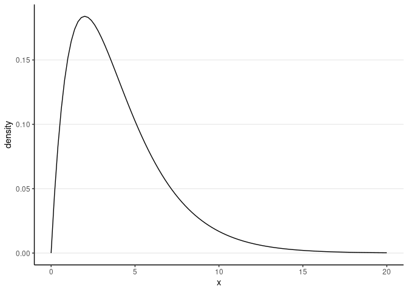

Simulating Means and Medians
================
Mark Lai
April 26, 2019, last updated on June 06, 2021

-   [Simulating Means and Medians](#simulating-means-and-medians)
    -   [Central Limit Theorem (CLT)](#central-limit-theorem-clt)
        -   [Examining CLT with
            Simulation](#examining-clt-with-simulation)
    -   [Comparing Means and Medians](#comparing-means-and-medians)
        -   [Relative Efficiency](#relative-efficiency)
        -   [Mean squared error (MSE)](#mean-squared-error-mse)
    -   [Exercise](#exercise)

# Simulating Means and Medians

``` r
# Load required packages
library(tidyverse)
theme_set(theme_classic() +
            theme(panel.grid.major.y = element_line(color = "grey92")))
```

## Central Limit Theorem (CLT)

We know that, based on the CLT, under very general regularity
conditions, when sample size is large, the sampling distribution of the
sample mean will follow a normal distribution, with mean equals to the
population mean,
, and standard
deviation (which is called the standard error in this case) equals the
population *SD* divided by the square root of the fixed sample size. Let
 be
the sample mean, then

")

### Examining CLT with Simulation

Let’s imagine that a researcher is interested in studying the house size
in the Orlando, Florida, measured in 1,000 sq ft. Hypothetically, the
researcher would like to assume assume that the population house sizes
follow a

distribution with four degrees of freedom, and would like to see how
random samples of different houses would behave. If we use
 to represent the random
variable for house sizes, the population can be described as

")

``` r
ggplot(tibble(x = c(0, 20)), aes(x = x)) + 
  stat_function(fun = dchisq, args = list(df = 5), bw = "SJ") + 
  labs(y = "density")
```

    ># Warning: Ignoring unknown parameters: bw

<!-- --> As can
be seen, the typical house size is around 2,000 to 5,000 sq ft.

It is known that for a
")
distribution, the population mean is
 = 4 and the
population variance is

=  = 8,
so we expect the mean of the sample means to be 4, and the standard
error to be
}").

#### Sample size of 10

Let’s draw repeated samples of size 10 from this population. Here is the
code for doing it once, using the `rchisq()` function:

``` r
set.seed(1928)
sample_size <- 10  # define sample size
sam1 <- rchisq(sample_size, df = 4)  # draw random sample
ggplot(tibble(x = sam1), aes(x = "sample 1", y = x)) + 
  geom_boxplot() +
  geom_jitter(width = 0.05, height = 0) +
  stat_summary(fun = mean, geom = "point", col = "red", size = 3)
```

<!-- -->

The mean of the simulated sample is 4.36, which is different from the
population mean (of course) but not too far off. With simulation, we can
see what happens with a few more samples

``` r
# Draw four more random sample
new_sam <- replicate(4, expr = rchisq(sample_size, df = 4), 
                     simplify = FALSE)
sam <- c(list(sam1), new_sam)
ggplot(tibble(sam, sample_id = factor(seq_len(5))) %>%
         unnest(cols = sam), 
       aes(x = sample_id, y = sam)) + 
  geom_boxplot() +
  geom_jitter(width = 0.05, height = 0) +
  stat_summary(fun = mean, geom = "point", col = "red", size = 3)
```

<!-- -->

Now do it 1,000 times, using a for loop. Also, set the seed so that
results are replicable:

``` r
NREP <- 1000  # number of replications
sample_size <- 10  # define sample size
# Initialize place holders for results
sam_means <- rep(NA, NREP)  # an empty vector with NREP elements
for (i in seq_len(NREP)) {
  sam_means[i] <- mean(rchisq(sample_size, df = 4))
}
# Plot the distribution of the means:
ggplot(tibble(sam_means), aes(x = sam_means)) + 
  geom_histogram()
```

    ># `stat_bin()` using `bins = 30`. Pick better value with `binwidth`.

<!-- -->

``` r
# Check normality
ggplot(tibble(sam_means), aes(sample = sam_means)) + 
  stat_qq() + 
  stat_qq_line()
```

<!-- -->

``` r
# Descriptive statistics
psych::describe(sam_means)
```

    >#    vars    n mean   sd median trimmed  mad  min  max range skew kurtosis   se
    ># X1    1 1000 4.03 0.89   3.96    3.99 0.89 1.91 8.37  6.46  0.5     0.63 0.03

As can be seen, it’s not fully normal. The mean of the sample means is
4.03, which is pretty close to the population mean of 4. The standard
error is 0.89, also similar to the theoretical value.

#### Sample size of 50

Now, repeat the simulation with a sample size of 50

``` r
NREP <- 1000  # number of replications
sample_size <- 50  # define sample size
# Initialize place holders for results
sam_means <- rep(NA, NREP)  # an empty vector with NREP elements
for (i in seq_len(NREP)) {
  sam_means[i] <- mean(rchisq(sample_size, df = 4))
}
# Plot the means:
ggplot(tibble(sam_means), aes(x = sam_means)) + 
  geom_histogram()
```

    ># `stat_bin()` using `bins = 30`. Pick better value with `binwidth`.

<!-- -->

``` r
# Check normality
ggplot(tibble(sam_means), aes(sample = sam_means)) + 
  stat_qq() + 
  stat_qq_line()
```

<!-- -->

``` r
# Descriptive statistics
psych::describe(sam_means)
```

    >#    vars    n mean  sd median trimmed  mad min  max range skew kurtosis   se
    ># X1    1 1000 4.01 0.4      4       4 0.42 2.9 5.43  2.53 0.24     0.01 0.01

The sampling distribution is closer to normal now. The standard error is
of course smaller.

With these examples, hopefully you get an idea how simulation can be
used to verify some theoretical results. Also, a lot of theoretical
results only work for large samples, so simulation results fill the gap
by providing properties of some estimators (sample mean of a
")
distribution in this case) in finite samples.

## Comparing Means and Medians

There is also a version of CLT for the sample medians, in that the
median can also be used to estimate the population median. For symmetric
distributions, this means that the sample median can also be used to
estimate the population mean. Let’s try a normal distribution with mean
of 4 and variance of 8:

``` r
NREP <- 1000  # number of replications
sample_size <- 10  # define sample size
# Initialize place holders for results
sam_medians <- rep(NA, NREP)  # an empty vector with NREP elements
for (i in seq_len(NREP)) {
  sam_medians[i] <- median(rnorm(sample_size, mean = 4, sd = sqrt(8)))
}
# Plot the means:
ggplot(tibble(sam_medians), aes(x = sam_medians)) + 
  geom_histogram()
```

    ># `stat_bin()` using `bins = 30`. Pick better value with `binwidth`.

<!-- -->

``` r
# Check normality
ggplot(tibble(sam_medians), aes(sample = sam_medians)) + 
  stat_qq() + 
  stat_qq_line()
```

<!-- -->

``` r
# Descriptive statistics
psych::describe(sam_medians)
```

    >#    vars    n mean   sd median trimmed  mad   min max range skew kurtosis   se
    ># X1    1 1000 3.93 1.02   3.95    3.93 1.03 -0.18 6.9  7.07 -0.1    -0.04 0.03

As can be seen, the sample median has a mean of 3.925422, and a standard
error of 1.0213287. Notably, this is larger than the theoretical
standard error of the sample mean, 0.8944272.

### Relative Efficiency

Thus, under the same sample size with a normal population, the standard
error of the sample median is larger than that of the sample mean. This
means that, on average, the sample mean will be closer to the population
mean, even when both are unbiased. Therefore, the sample mean should be
preferred, which is what we do.

When comparing two *unbiased estimators*, we say that the one with a
smaller sampling variance (i.e., squared standard error) to be more
**efficient**. The relative efficiency of estimator
, relative to
estimator , is
defined as

}{\textrm{Var}(T_1)}")

For example, based on our simulation results, the relative efficiency of
the sample median, relative to the sample mean, is

``` r
var_sam_mean <- 8 / 10  # theoretical value
var_sam_median <- var(sam_medians)
(re_median_mean <- var_sam_mean / var_sam_median)
```

    ># [1] 0.7669357

This means that in this case, the sample median is only 77% as efficient
as the sample mean. Although it is true that for a normal distribution,
the sample mean is more efficient than the sample median, there are
situations where the sample median is more efficient. You can check that
in the exercise.

### Mean squared error (MSE)

The MSE is defined as the average squared distance from the sample
estimator to the target quantity it estimates. we can obtain the MSE for
the sample median in the previous example as:

``` r
(mse_sam_median <- mean((sam_medians - 4)^2))
```

    ># [1] 1.047631

In general, for any estimators
 (with finite means and
variances), the MSE can be decomposed as

^2 + \textrm{Var}(T)")

so for unbiased estimators, MSE is the same as the sampling variance. On
the other hand, for biased estimators, it is often of interest to
compare their MSEs (or sometimes the square root of it, RMSE) to see
which estimator has the best trade-off between biasedness and
efficiency. Many estimators in statistics sacrifices a little bit in
unbiasedness but get much smaller sampling variance.

## Exercise

1.  Generate a sample of 30 from a
     distribution with
    df = 4. Show a plot of the data. Compute the sample mean and SD.
    (Hint: you can use the `rt()` function.)

2.  Compare the efficiency of the sample mean and the sample median in
    estimating the mean of a population following a student
     distribution with
    df = 4. You can choose any sample size of at least 30. Which one,
    sample mean or sample median, is more efficient?
